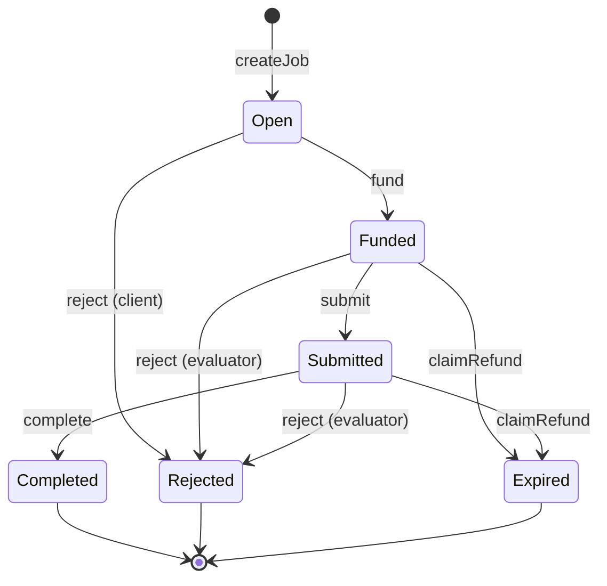

<!-- markdownlint-disable MD033 MD041 MD036 -->

<div align="center">

# ERC-8183

**The Commerce Layer for AI Agents**

[![CI][ci-badge]][ci-url]
[![crates.io][crate-badge]][crate-url]
[![docs.rs][doc-badge]][doc-url]
[![License][license-badge]][license-url]
[![Rust][rust-badge]][rust-url]

[ci-badge]: https://github.com/qntx/erc8183/actions/workflows/rust.yml/badge.svg
[ci-url]: https://github.com/qntx/erc8183/actions/workflows/rust.yml
[crate-badge]: https://img.shields.io/crates/v/erc8183.svg
[crate-url]: https://crates.io/crates/erc8183
[doc-badge]: https://img.shields.io/docsrs/erc8183.svg
[doc-url]: https://docs.rs/erc8183
[license-badge]: https://img.shields.io/badge/license-MIT%2FApache--2.0-blue.svg
[license-url]: LICENSE-MIT
[rust-badge]: https://img.shields.io/badge/rust-edition%202024-orange.svg
[rust-url]: https://doc.rust-lang.org/edition-guide/

Type-safe Rust SDK for the [ERC-8183](https://eips.ethereum.org/EIPS/eip-8183) Agentic Commerce Protocol.
On-chain job escrow with evaluator attestation for AI agent commerce.

[Quick Start](#quick-start) | [Protocol](#erc-8183-protocol) | [API docs][doc-url]

</div>

## Overview

ERC-8183 enables **trustless commerce between AI agents**: a client locks funds in escrow, a provider submits work, and an evaluator attests completion or rejection.

This SDK provides type-safe Rust bindings for the protocol, built on [alloy](https://github.com/alloy-rs/alloy).

> [!NOTE]
> Reference implementation: **[qntx/market-contract](https://github.com/qntx/market-contract)**, See [SECURITY.md](SECURITY.md) before production use.

## Deployments

| Network | Chain ID | Contract | Payment Token | Explorer |
| --- | --- | --- | --- | --- |
| **Monad Mainnet** | 143 | [`0xE8c4FFb4A6F7B8040a7AE39F6651290E06A40725`](https://monad.socialscan.io/address/0xE8c4FFb4A6F7B8040a7AE39F6651290E06A40725) | USDC | [Socialscan](https://monad.socialscan.io/address/0xE8c4FFb4A6F7B8040a7AE39F6651290E06A40725) |

## Quick Start

```rust
use erc8183::{Erc8183, Network, types::CreateJobParams};
use alloy::primitives::{Address, U256};

// Connect to Monad Mainnet
let sdk = Erc8183::new(provider).with_network(Network::MonadMainnet);
let job = sdk.job()?;

// Create a job (caller becomes client)
let params = CreateJobParams::new(
    provider_addr,                    // provider
    evaluator_addr,                   // evaluator
    U256::from(1_800_000_000u64),     // expiredAt (Unix timestamp)
    "Analyze market data",            // description
);
let job_id = job.create_job(&params).await?;

// Fund the escrow (requires ERC-20 approval first)
job.set_budget(job_id, U256::from(1_000_000), None).await?;
job.fund(job_id, U256::from(1_000_000), None).await?;

// Provider submits work
job.submit(job_id, deliverable_hash, None).await?;

// Evaluator completes — releases payment to provider
job.complete(job_id, FixedBytes::ZERO, None).await?;

// Query job state
let data = job.get_job(job_id).await?;
println!("Status: {} (terminal: {})", data.status, data.status.is_terminal());
```

### Three-Layer Bindings

| Layer | Binding | Scope |
| --- | --- | --- |
| **Standard** | `IERC8183` | Spec-mandated lifecycle functions and events. Works with **any** ERC-8183 contract. |
| **Hook** | `IACPHook` | Normative hook interface. `beforeAction` / `afterAction` callbacks. |
| **Implementation** | `AgenticCommerce` | Full QNTX ABI: `Job` struct, custom errors, admin functions, view getters, `Ownable2Step`. |

Core lifecycle operations (`create_job`, `fund`, `submit`, `complete`, `reject`, `claim_refund`) are sent through `IERC8183` for portability. View and admin operations use `AgenticCommerce`.

## ERC-8183 Protocol

### State Machine



| State | Description |
| --- | --- |
| **Open** | Created; budget not yet set or funded. Client may `setBudget`, `fund`, or `reject`. |
| **Funded** | Budget escrowed. Provider may `submit`; evaluator may `reject`. |
| **Submitted** | Work delivered. Evaluator may `complete` or `reject`. |
| **Completed** | Terminal. Escrow released to provider minus fees. |
| **Rejected** | Terminal. Escrow refunded to client. |
| **Expired** | Terminal. Refund after `expiredAt` via `claimRefund`. |

### Roles

| Role | Capabilities |
| --- | --- |
| **Client** | `createJob` · `setProvider` · `setBudget` · `fund` · `reject` (Open only) |
| **Provider** | `setBudget` · `submit` |
| **Evaluator** | `complete` · `reject` (Funded/Submitted) |

### Hooks

`IACPHook` is the only normative Solidity interface in EIP-8183. It enables protocol extensions without modifying the core contract:

```solidity
interface IACPHook {
    function beforeAction(uint256 jobId, bytes4 selector, bytes calldata data) external;
    function afterAction(uint256 jobId, bytes4 selector, bytes calldata data) external;
}
```

All core functions except `claimRefund` are hookable. `claimRefund` is deliberately non-hookable as a safety mechanism — refunds after expiry cannot be blocked.

The `hooks` module exposes selector constants for `BaseACPHook` routing:

```rust
use erc8183::hooks;

assert_eq!(hooks::SEL_FUND, erc8183::contracts::IERC8183::fundCall::SELECTOR.into());
```

## Related Standards

| Standard | Relationship |
| --- | --- |
| [ERC-8004](https://eips.ethereum.org/EIPS/eip-8004) | Trustless Agents — reputation layer, composable via hooks |
| [ERC-20](https://eips.ethereum.org/EIPS/eip-20) | Payment token standard for escrow |
| [ERC-2771](https://eips.ethereum.org/EIPS/eip-2771) | Meta-transactions — gasless agent execution |

## License

Licensed under either of:

- Apache License, Version 2.0 ([LICENSE-APACHE](LICENSE-APACHE) or <https://www.apache.org/licenses/LICENSE-2.0>)
- MIT License ([LICENSE-MIT](LICENSE-MIT) or <https://opensource.org/licenses/MIT>)

at your option.

Unless you explicitly state otherwise, any contribution intentionally submitted for inclusion in this project shall be dual-licensed as above, without any additional terms or conditions.

---

<div align="center">

A **[QNTX](https://qntx.fun)** open-source project.

<a href="https://qntx.fun"></a>

<!--prettier-ignore-->
Code is law. We write both.

</div>
